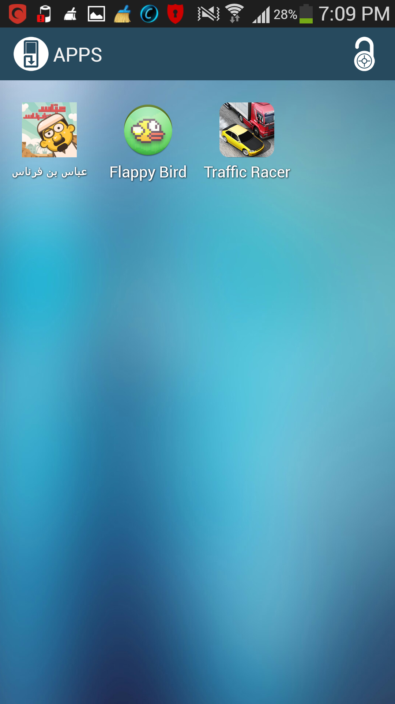
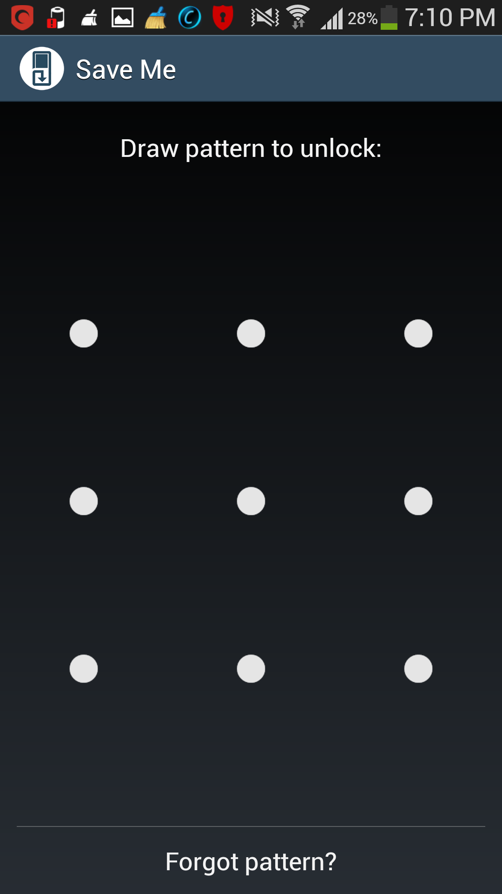
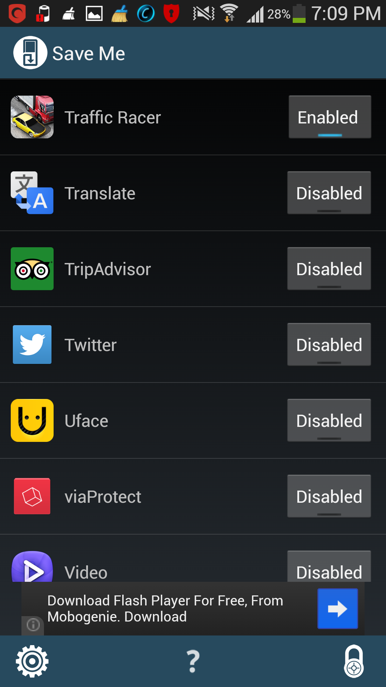

# SaveMe

This is the repository of my beloved App "SaveMe", It's one the greatest Apps created by my first startup [ServeMe](https://www.facebook.com/Serve.meLi) with one of my greatest trainees and colleagues Omar Albelbaisy.

I love this App too much but Google changed thier Android framwork APIs and Google Play policeies to kill this kind of apps so we can not move forward with this App anymore.

I'm sharing its code now to inspire people :)

# Screenshots
  

# License

A copy of the license is also available in the [license file](LICENSE).

# Download

#### Please do not run this App on your device! use the emulator to test it!

